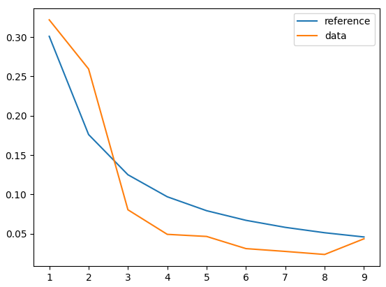

# Benford's Law Test on XKCD

Parses the Transcripts and Alt text for each XKCD comic and then plots the frequency of the first digit against the expected log10(1 + 1/x) value.

Run the `download_comics.py` file first.
Then run the `run_test.py` file to make the plot

## Results

